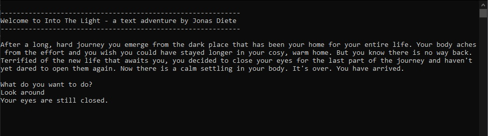
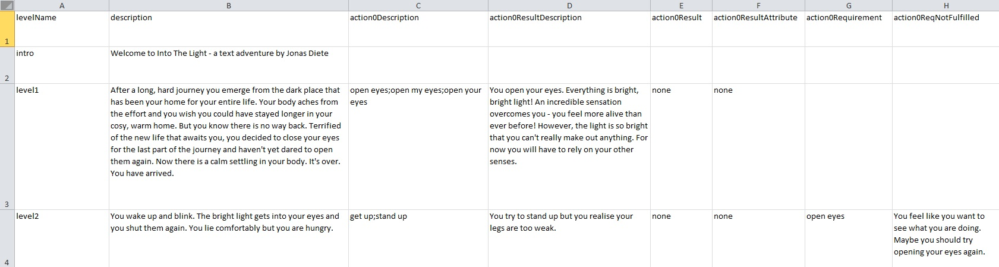
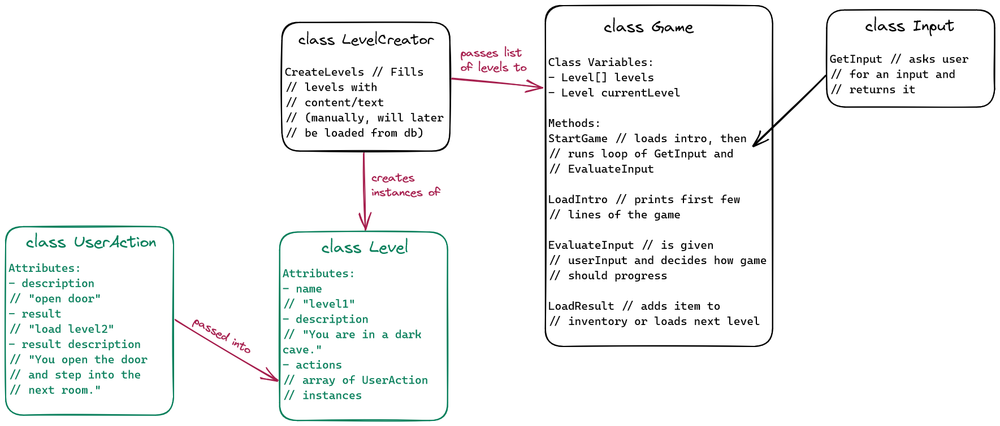

# Text Adventure - Into The Light

This is a little project to help me consolidate my C# skills.  

I focused on writing neat high-quality code using OOP.

This is a console application. It uses C# (.NET 6.0 framework) and NUnit for testing.

## How to Play
1. Download this repository (or alternatively just download the "Into The Light" folder).
2. Change directory into the downloaded folder and then to the "Into The Light" folder.
3. Run `TextAdventure.exe`. Alternatively run `dotnet TextAdventure.dll`.
4. Play!

This is a Text Adventure in the tradition of the great 1970s Adventure games like Zork or The Hitchhiker's Guide to the Galaxy.   
You have to navigate the world by typing commands into the console.  
Traditionally they are commands like `Go to ...`, `Look at ...` or `Open ...`, but part of the fun is to try to work out the correct commands to get to progress in the game. If you type in an unkown command the game will tell you.  
  
  

I built this adventure so that it is simple to edit. Other levels and text adventures can be built easily by editing the CSV file in the game directory. You can write your own adventure game, by looking at the levels.csv file and editing this. You can write the levels and the actions that the player can perform in each level. My program will make it into a working text adventure.
Here is an example of the CSV file:  
  

When working on this project, I created an overview of my classes with Excalidraw to help me keep an overview of the different variables and methods and how everything links together.

