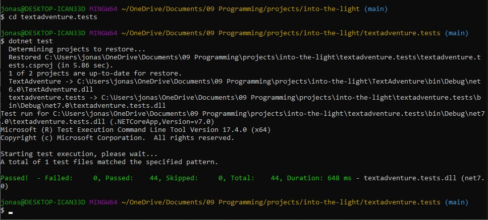

# Text Adventure - Into The Light

This is a project that helped me consolidate my C# skills.  

I focused on writing neat high-quality code using OOP, making the game easy to adapt and even enabling users to write their own text adventures easily.

This is a console application. It uses C# (.NET 6.0 framework) and NUnit for testing.

### How to Play
1. Download this repository (or alternatively just download the "Into The Light" folder).
2. Change directory into the downloaded folder and then to the "Into The Light" folder.
3. Run `TextAdventure.exe`. Alternatively run `dotnet TextAdventure.dll`.
4. Play!

This is a Text Adventure in the tradition of the great 1970s Adventure games like Zork or The Hitchhiker's Guide to the Galaxy.   
You have to navigate the world by typing commands into the console.  
Traditionally they are commands like `Go to ...`, `Look at ...` or `Open ...`, but part of the fun is to try to work out the correct commands to progress in the game. If you type in an unkown command the game will tell you.  
  
  

## How to build your own text adventure
I built this adventure so that it is simple to edit. Other levels and text adventures can be built easily by editing the CSV file in the game directory. You can write your own adventure game, by looking at the `levels.csv` file inside the `TextAdventure` folder and editing this. You can write the levels and the actions that the player can perform in each level. My program will make it into a working text adventure.
Here is an example of the CSV file:  
  

### How to edit the levels.csv file
Open the file with a spreadsheet software such as excel or with a csv viewer.
There are different headings in the first row that explain what to write in the following rows:
- `levelName`: Each level has to have a unique name. The user will never see the level names, they are just for you and you can name them however you want. They could simply be level1, level2, level3, or they could be names of locations, such as cave, beach, hilltop. The last level needs to be called `end` and will just describe the ending of the game with no options for the player.
- `description`: Write a text here that describes the level to the player. The level description of the first level you write will be the title of the game.  

Now follow the different actions that the player can perform in each level. At the moment this is limited to 10 (action0 - action9).  
- `action0description`: what the player has to type in to perform this action. There can be multiple (unlimited) action descriptions that all have the same effect. They must be separated by a semi-colon `;`. Example: `move rug;pull rug to side;look under rug`
- `action0ResultDescription`: The text that is displayed as a result of the action. Example: `You move the rug to the side. Underneath there is a trapdoor.`
- `action0Result`: the effect of this action. It can be `load` to load a new level, `get` to receive an item, or `none`.
- `action0ResultAttribute`: the second word to specify the result. If the result is `load`, the attribute has to be the name of the level that it loads, e.g. `level2`. If the result is `get`, the attribute must be an item name, e.g. `battle axe`. If the result is `none`, the attribute should also be `none`.
- `action0Requirement`: this can be an action desctription of an action that has to be completed, so the current action works, e.g. `look around dining room` (to spot the rug). If there were multiple descriptions separated by a semi-colon, just write the first one of those here. The requirement can also be to `have` an item in the inventory, e.g. `have potion of strength`. The requirement can also be `none` or simply left empty.
- `action0RequirementNotFulfilled`: the message displayed to the player if the requirement is not fulfilled. E.g. `You are not strong enough and you don't have a potion of strength`.

Have fun building your own adventure game!

## My Planning

When working on this project, I created an overview of my classes with Excalidraw to help me keep an overview of the different variables and methods and how everything links together. I updated this at various times during the project to reflect the implementation.

## Testing

I used NUnit to test the functions of the program. To understand what each of the functions do and how they work, you can read the tests. The test files are all in the /TextAdventure.Tests folder. I have written 42 tests.  

### How to run the tests:
1. Download this repository.
2. Change into the the `TextAdventure.Tests` directory.
3. Type in `dotnet test`.